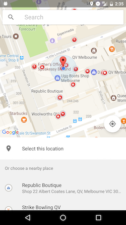

# Silentium

Toy that allows your device to go silent on certain pre-define regions.

## Getting Started

## Pre-requisites

## Deployment

## Built With

## Contributing

Please read CONTRIBUTING.md for details on our code of conduct, and the process for submitting pull requests to us.

## Versioning

We use SemVer for versioning. For the versions available, see the tags on this repository.

## License

This project is licensed under the MIT License - see the [LICENSE](./LICENSE.md) file for details.

### Screenshots

  
  

### Report Issues
Notice any issues with a repository? Please file a github issue in the repository.
